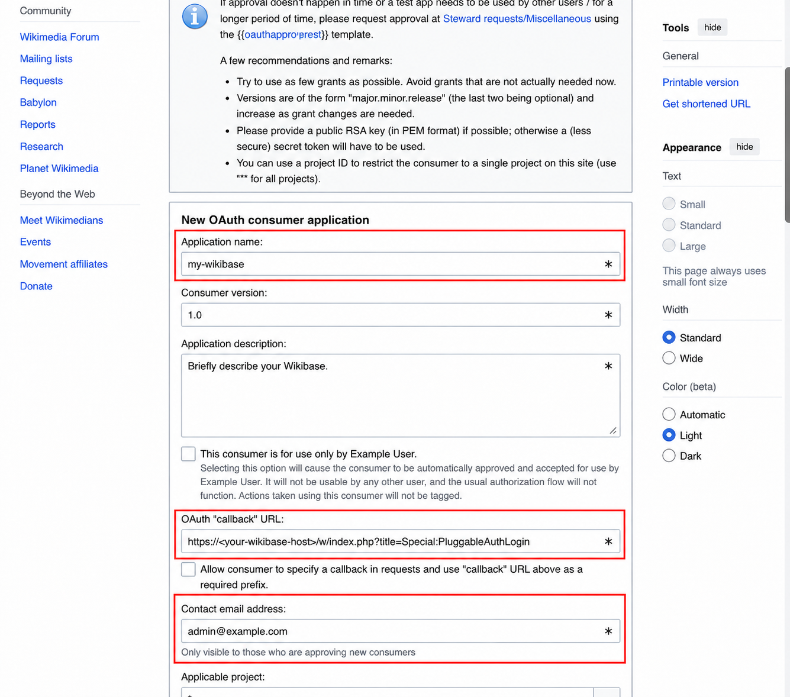
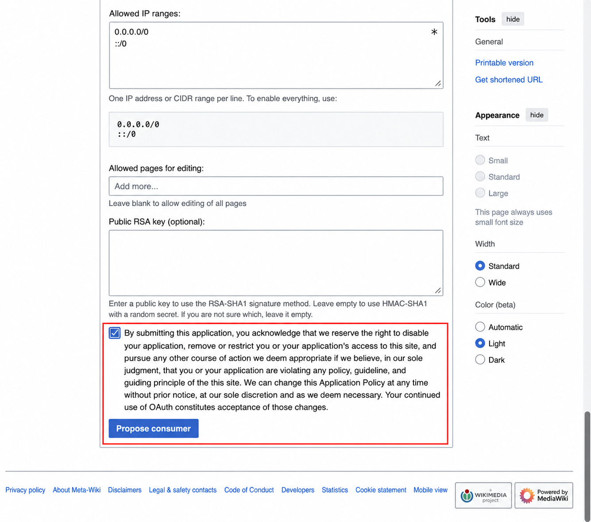

# Enabling Login with Wikimedia

Login with Wikimedia lets people sign in to your Wikibase with the same Wikimedia account they use on Wikidata, Wikipedia, and other Wikimedia projects. It gives members of the Wikimedia community a familiar way to participate without creating and managing another password.

The first time someone uses this option, Wikibase Suite (WBS) creates a corresponding local account for them.

> [!IMPORTANT]
> By default, enabling Login with Wikimedia allows anyone with a Wikimedia account to create a local account and log in to your Wikibase. If you want to enable Wikimedia login without automatically granting access to new users, follow [Require an existing local account](#optional-require-an-existing-local-account).

## Instructions

You need a Wikimedia account to register the OAuth consumer. Your WBS instance must be available over HTTPS, and you need access to the `.env` file in your WBS directory.

1. Open [Wikimedia OAuth consumer registration](https://meta.wikimedia.org/wiki/Special:OAuthConsumerRegistration/propose/oauth1a) and log in to your Wikimedia account if prompted.



2. Describe your Wikibase in the required fields:

   - **Application name:** Enter a name that identifies your Wikibase.
   - **Application description:** Briefly describe your Wikibase and how it will use Wikimedia login.
   - **Contact email address:** Enter an address where Wikimedia OAuth administrators can contact you about the consumer.

3. In **OAuth "callback" URL**, enter:

   ```url
   https://<your-wikibase-host>/w/index.php?title=Special:PluggableAuthLogin
   ```

   Replace `<your-wikibase-host>` with your Wikibase hostname.

<br clear="right">
<br>



4. Keep the remaining default settings, including the default basic permissions. At the bottom of the form, select the acknowledgement checkbox, then select **Propose consumer**.

<br clear="right">
<br>

5. Copy the **consumer token** and **secret token** shown after the consumer is created.

   > [!WARNING]
   > Store the secret token securely. Do not share it or commit it to version control.

6. If you have not already, [log in to your server and change to your WBS directory](./README.md#access-your-wbs-server).

7. In the `.env` file in your WBS directory, add the credentials returned by Wikimedia:

   ```dotenv
   WIKIMEDIA_OAUTH_CONSUMER_TOKEN=<your-consumer-token>
   WIKIMEDIA_OAUTH_SECRET_TOKEN=<your-secret-token>
   ```

8. Apply the new configuration:

   ```sh
   docker compose up -d
   ```

9. Open the login page on your Wikibase and confirm that **Login with Wikimedia** appears below the standard login form.

10. Select **Login with Wikimedia** and complete the Wikimedia authorization flow. Confirm that you return to your Wikibase and are logged in.

## Optional: Require an existing local account

By default, anyone who can authenticate with Wikimedia can create a corresponding local account on your Wikibase. You can instead require people to create a local account and link it to their Wikimedia account before using Wikimedia login.

1. Near the end of `config/LocalSettings.php`, after the managed `require_once '/LocalSettings.Extensions.php';` line, add:

   ```php
   $wgOAuthDisallowRemoteOnlyAccounts = true;
   ```

2. Restart the Wikibase and job-runner services:

   ```sh
   docker compose restart wikibase wikibase-jobrunner
   ```

3. A user who wants to link accounts must first log in with their local Wikibase credentials.

4. In **Preferences**, under **User profile**, open **Manage remote accounts**, then select **Log in with Wikimedia**.

After the accounts are linked, the user can use **Login with Wikimedia** for future logins.
