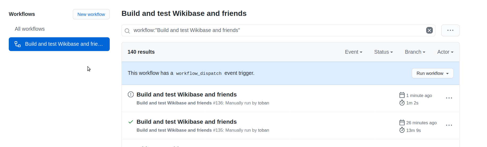

# The pipeline
## The versions folder

The `versions` folder contains .env files with the specific versions of the components to be build for that specific release.

For example, the `wmde1.env` file contains the following variables to tell the pipeline to use the [Wikibase REL1_35] branch and the `mediawiki` image.

```
...
WIKIBASE_BRANCH_NAME=REL1_35
MEDIAWIKI_BRANCH_NAME=REL1_35
...
``` 
## Github Actions Workflows

At it's core this repository is just a set of make targets that gets orchestrated by Github Actions workflows. We currently have the following workflows.
#### [.github/workflows/built_and_test.yml](.github/workflows/built_and_test.yml)

This is the main workflow that builds Wikibase and related software, tests it and then produces release candidate artifacts that can be used for further acceptance testing and publishing.
#### [.github/workflows/lint.yml](.github/workflows/lint.yml)

This is internal linting for the release pipeline, it does not lint any of the release artifacts.
#### [.github/workflows/test.yml](.github/workflows/test.yml)

This workflow is used to run the tests against a previous build without having to download them.
#### [.github/workflows/publish.yml](.github/workflows/publish.yml)

This workflow is used to publish the artifacts of a workflow from Github.

## Running the pipeline on github

The build workflow will trigger on pushes to the env file configured as the default version.

```yml
env:
  env_file: ${{ github.event.inputs.env_file || '.env' }}

```

If there is a requirement to build a specific version this can be done by changing the default for the whole pipeline or manually running the pipeline.

To manually run the pipeline go to to actions, click the workflow and run the workflow with the desired `.env` file from the versions folder.



## Artifacts on github

After triggering the pipeline a set of jobs will start running, which after a successful run will result in a number of artifacts as described in the diagram below.



`BuildArtifacts` - contains the release candidate artifact for each component that was built.

`BuildMetadata` - contains artifacts describing what was built for each component that is included. Also contains the artifacts produced by the finishing `version` job that describe which versions were used when building / testing.

`TestArtifacts` - contains logs and screenshots from testing.

`TestExampleArtifacts` - contains logs from testing done to the `example/` folder

`TestUpgradeArtifacts` - contains logs from upgrades from older versions to this newly built one.

## Running the pipeline locally

To execute the entire build pipeline you can use the `all` make target.

```sh
./build.sh all versions/wmde1.env
```

To build single artifacts locally you can issue the following command.

```sh
./build.sh wikibase versions/wmde1.env
```

The output ends up in the `artifacts/` folder and will be built as described by the `versions/wmde1.env` environment file.


See the [Makefile](../../Makefile) for more build options.

## Local artifacts

When building locally the artifacts will be output into the root of the `artifacts/` folder as they are not into zip packages as on Github.


### Clean local artifacts
To remove any locally produced artifacts you can run the following commands.

```sh
make clean
```

To clean the git_cache used for building

```sh
make clean-cache
```
### Downloaded artifacts

Any downloaded artifacts from workflow runs on github actions will be saved as a folder under `artifacts/<WORKFLOW_ID>` and are exempt from any cleaning commands.

For more info on downloading artifacts from github see [publishing](publishing.md).

[Wikibase REL1_35]: https://gerrit.wikimedia.org/g/mediawiki/extensions/Wikibase/+/refs/heads/REL1_35

## The local.env file

On build a local.env file can be used to override any default settings

#### Use locally installed selenium test dependencies
```
SKIP_INSTALL_SELENIUM_TEST_DEPENDENCIES=1
```
#### Override for branch name of extensions cloned from gerrit
```
GERRIT_EXTENSION_BRANCH_NAME=REL1_35
```
#### Lower the compression rate to make local builds faster
```
GZIP_COMPRESSION_RATE=1
```
#### Log level for selenium tests see wdio.conf.js for options
```
SELENIUM_LOG_LEVEL=trace
```
#### Timeout for mocha tests
```
MOCHA_OPTS_TIMEOUT=90
```

#### Settings related to tarball publishing
See [publishing](publishing.md).