# The pipeline
## The versions folder

The `channels` folder contains .env files defining all supported version channels. 

- `lts` for long term support
- `stable` for the current latest stable version
- `next` for cutting edge builds of unreleased components

The .env files specify the actual version built, its [Semantic Version](https://semver.org/) number and all the component versions it consits of.

## Github Actions Workflows

At it's core this repository is just a set of make targets that gets orchestrated by Github Actions workflows. We currently have the following workflows.

#### [.Github/workflows/build_and_test.yml](.github/workflows/build_and_test.yml)
This is the main workflow that builds Wikibase and related software, tests it and then produces release candidate artifacts that can be used for further acceptance testing and publishing.

#### [.Github/workflows/publish.yml](.github/workflows/publish.yml)

This workflow is used to publish the artifacts of a workflow from Github.

#### [.Github/workflows/publish.yml](.github/workflows/test_example.yml)

This workflow tests against the docker-compose in the `example` directory.

## Running the pipeline on Github

The build workflow will trigger on pushes on `main` and PRs.

If there is a requirement to build a specific version this can be done by reverting to a certain git commit.

## Artifacts on Github

After triggering the pipeline a set of jobs will start running, which after a successful run will result in a number of artifacts as described in the diagram below.



`DockerImages-lts`, `DockerImages-stable`, `DockerImages-next` - contains the release candidate docker images for each component that was built.

`TarBalls-lts`, `TarBalls-stable`, `TarBalls-next` - contains the release candidate tar archives for each component that was built.

`Metadata-lts`, `Metadata-stable`, `Metadata-next` - contains artifacts describing what was built for each component that is included. Also contains the artifacts produced by the finishing `metadata` job that describe which versions were used when building / testing.

`TestResults-lts`, `TestResults-stable`, `TestResults-next`  - contains logs and screenshots from testing.

`ScanResults-lts`, `ScanResults-stable`, `ScanResults-next`  - contains logs from vulnerability testing.


## Running the pipeline locally

To execute the entire build pipeline you can use the `all` make target.

```sh
./build.sh all channels/stable.env
```

To build single artifacts locally you can issue the following command.

```sh
./build.sh wikibase channels/stable.env
```

The output ends up in the `artifacts/` folder and will be built as described by the `channels/stable.env` environment file.


See the [Makefile](../../Makefile) for more build options.

## Local artifacts

When building locally the artifacts will be output into the `artifacts/` folder. They are not zip'd as on Github.

### Clean local artifacts

To remove any locally produced artifacts you can run the following commands.

```sh
make clean
```

To clean the git_cache used for building

```sh
make clean-cache
```

### Downloaded artifacts

Any downloaded artifacts from workflow runs on Github actions will be saved as a folder under `artifacts/<WORKFLOW_ID>` and are exempt from any cleaning commands.

For more info on downloading artifacts from Github see [publishing](publishing.md).

[Wikibase REL1_35]: https://gerrit.wikimedia.org/g/mediawiki/extensions/Wikibase/+/refs/heads/REL1_35

## The local.env file

On build a local.env file can be used to override any default settings

#### Override for branch name of extensions cloned from gerrit
```
GERRIT_EXTENSION_BRANCH_NAME=REL1_35
```
#### Lower the compression rate to make local builds faster
```
GZIP_COMPRESSION_RATE=1
```
#### Log level for selenium tests see wdio.conf.js for options
```
SELENIUM_LOG_LEVEL=trace
```
#### Timeout for mocha tests
```
MOCHA_OPTS_TIMEOUT=90
```

#### Settings related to tarball publishing
See [publishing](publishing.md).
